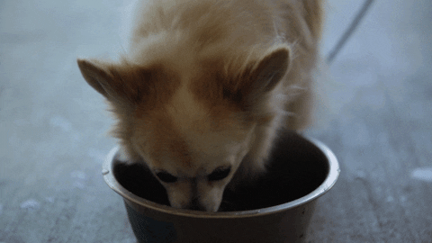

# 1) Smart Pet Food & Water Automator
Smart Pet Food & Water Automator is designed to meet the nutritional and water needs of your pet friends, even when you're not at home.

## 1.1) Description
This smart device allows you to regulate your pets' feeding and drinking patterns remotely via GSM/Wifi technology. Whether you're at work or on vacation, you can rest assured that your pets are being taken care of.

## 1.2) Main Features
***Remote Access:*** Manage your pets' nutrition and water needs from anywhere using GSM/Wifi technology.

***Timing Function:*** Set up automatic feeding schedules based on your pets' daily routines.

**Manual Control:** Feed and water your pets instantly through the mobile application.

***Large Capacity:*** Equipped with spacious food and water tanks for long-term use.

**User-Friendly Design:** Easy installation and operation with an ergonomic design.

Don't let your busy schedule get in the way of your pets' well-being. With Smart Pet Food & Water Automator, you can ensure they're always fed and hydrated, no matter where you are.

## 1.3) Usage
 

## 1.4) Development
### 1.4.1) Requirements

**Hardware**: 
* STM32F0
* Quectel BC95 NB-IoT Module
* ESP32-C3 Mini Module

**Software/Tools**
* [STM32CubeIde](https://www.st.com/en/development-tools/stm32cubeide.html)
* [Termit](https://termite.software.informer.com/3.4/) (You can use any serial terminal you want)

# 2) License
This project is licensed under the Creative Commons Zero v1.0 Universal license. For details, see the [LICENSE](https://creativecommons.org/licenses/by-nc/1.0/deed.en) file.